<div align="center">

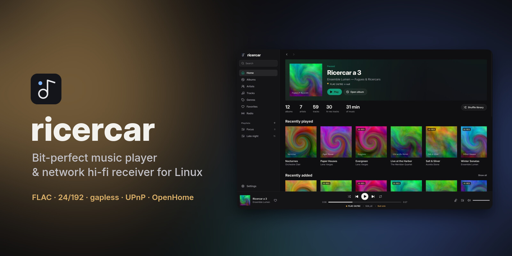

<br>

**Your lossless library and your streaming apps, played untouched to your DAC.**<br>
A native Linux music player that is also a UPnP / OpenHome network receiver.

[](https://github.com/pata27/ricercar/actions/workflows/ci.yml)
[](LICENSE)
[](https://www.rust-lang.org)


[Features](#-features) ·
[Screenshots](#-screenshots) ·
[Install](#-install) ·
[Stream from your phone](#-stream-from-your-phone) ·
[Bit-perfect](#-bit-perfect-for-real) ·
[FAQ](#-faq) ·
[Roadmap](#-roadmap)

</div>

---

## ✨ Why ricercar

Most Linux players either sound right or look right. ricercar tries to do both:

- **It never touches your samples.** Every track goes to an exclusive `hw:`
  ALSA device at its native rate and bit depth: no mixer, no resampling, no
  volume maths. A format the DAC can't take is refused, never quietly
  converted.
- **It shows the signal path instead of just claiming bit-perfect.** The
  chain (source → processing → output format → DAC) sits under the seek bar
  at all times; one click opens every hop and flags anything that changes
  the samples.
- **It is a real desktop app.** Album grid, artist pages, synced lyrics,
  queue, playlists, radio and search, native and fast, with no webview and no
  Electron.
- **It plays what your phone streams.** BubbleUPnP, Symfonium, Linn Kazoo or
  mConnect push Qobuz, Tidal or your NAS to ricercar the same way they would
  push to a hi-fi network streamer.

> ricercar is **inspired by QBZ** but is a clean-room project with no QBZ
> code. Like QBZ, it contains **no private or unofficial streaming-service
> API**. Catalogues reach it through standard UPnP / OpenHome, with your own
> subscription in your own app.

## 🎧 Features

<table>
<tr>
<td width="50%" valign="top">

### Audio
- Bit-perfect `hw:` output, exclusive access
- Native sample-rate switching per track
- Lossless container negotiation (S16 · S24_3LE · S24 · S32) for picky USB DACs
- Gapless, sample-exact within a rate
- FLAC · ALAC · WAV · AIFF · AAC · MP3 · Ogg Vorbis
- Hardware pause, device hot-switch, clean stop on unplug
- ReplayGain (track / album / auto) with peak protection (off by default)
- Seekable HTTP streams, internet radio with live titles

</td>
<td width="50%" valign="top">

### Library
- Fast incremental indexing with a folder watcher
- Instant accent-insensitive search (`bjork` finds Björk)
- Albums, artists (with "appears on"), genres, all tracks
- Favorites, play counts, history, most played
- Playlists with M3U / M3U8 import & export
- Covers: embedded, folder images, or Cover Art Archive
- Synced lyrics from `.lrc` files, tags or lrclib.net

</td>
</tr>
<tr>
<td valign="top">

### Desktop app
- Listening header: what plays, and how it reaches the DAC
- Format column on every track list (hi-res in gold)
- Full-screen now playing with synced, clickable lyrics
- Colours that follow the playing album cover
- Queue drawer with drag-to-reorder, context menus everywhere
- Dark & light themes, 7 accents, English & French
- Keyboard shortcuts, notifications, tray icon
- Remembers your queue and position

</td>
<td valign="top">

### Network & integration
- **UPnP AV MediaRenderer + OpenHome** (Product, Playlist, Info, Time, Volume) on one device
- **UPnP MediaServer**: browse your library from any DLNA app
- **MPRIS**: media keys, desktop widgets, `playerctl`
- **Scrobbling** to ListenBrainz & Last.fm (offline queue)
- `ricercar-cli` remote and a headless daemon for a dedicated audio box

</td>
</tr>
</table>

## 📸 Screenshots

<table>
<tr>
<td>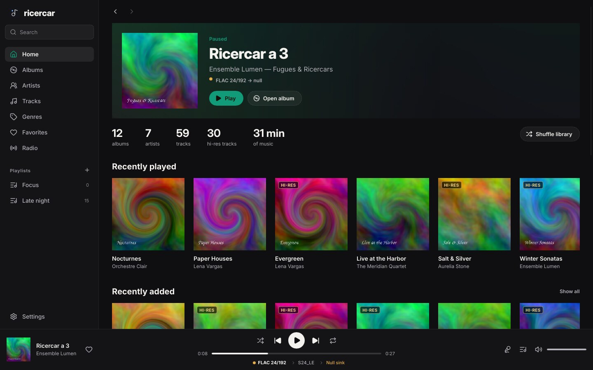</td>
<td>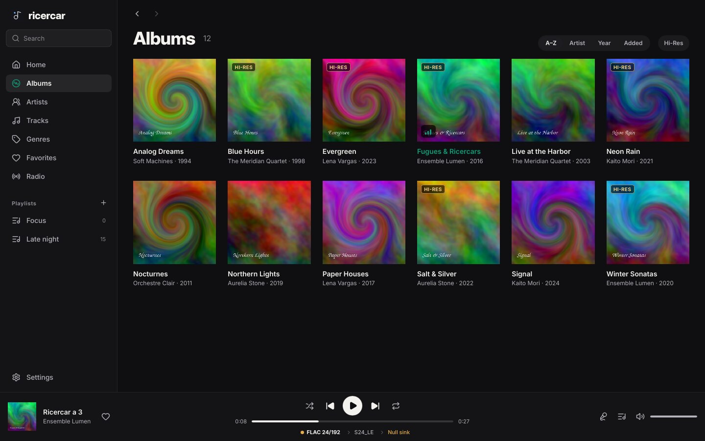</td>
</tr>
<tr>
<td align="center"><sub><b>Home</b>: what is playing and how it reaches the DAC</sub></td>
<td align="center"><sub><b>Albums</b>: responsive grid with hi-res badges</sub></td>
</tr>
<tr>
<td>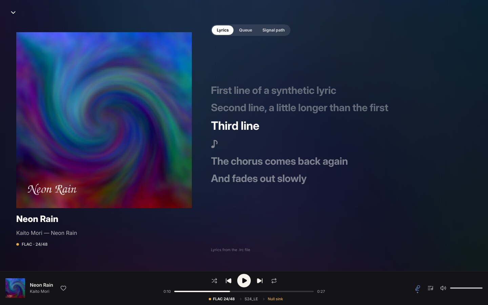</td>
<td>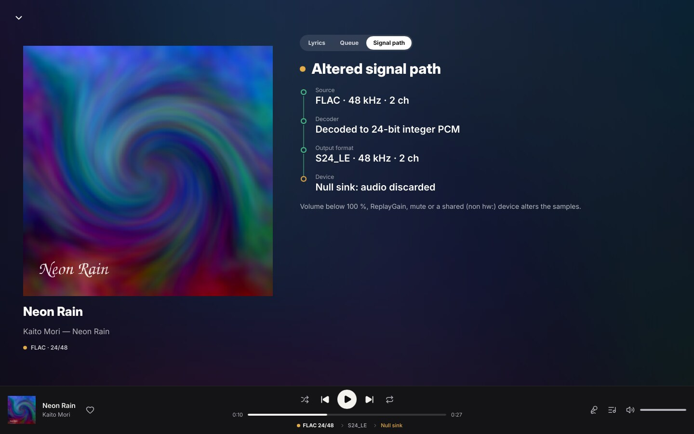</td>
</tr>
<tr>
<td align="center"><sub><b>Now playing</b>: synced lyrics over the cover</sub></td>
<td align="center"><sub><b>Signal path</b>: every hop from file to DAC</sub></td>
</tr>
<tr>
<td>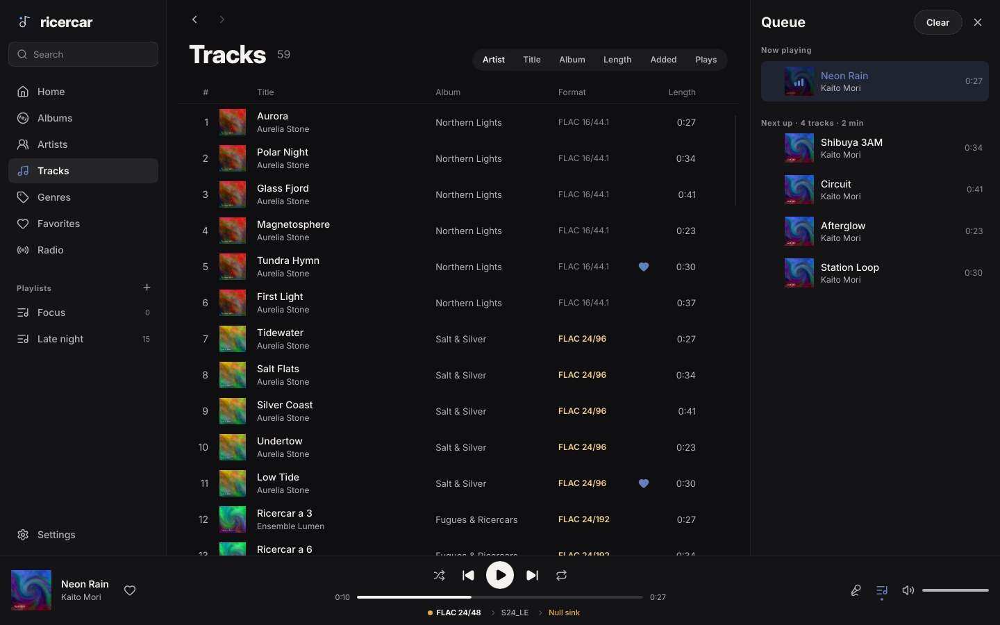</td>
<td>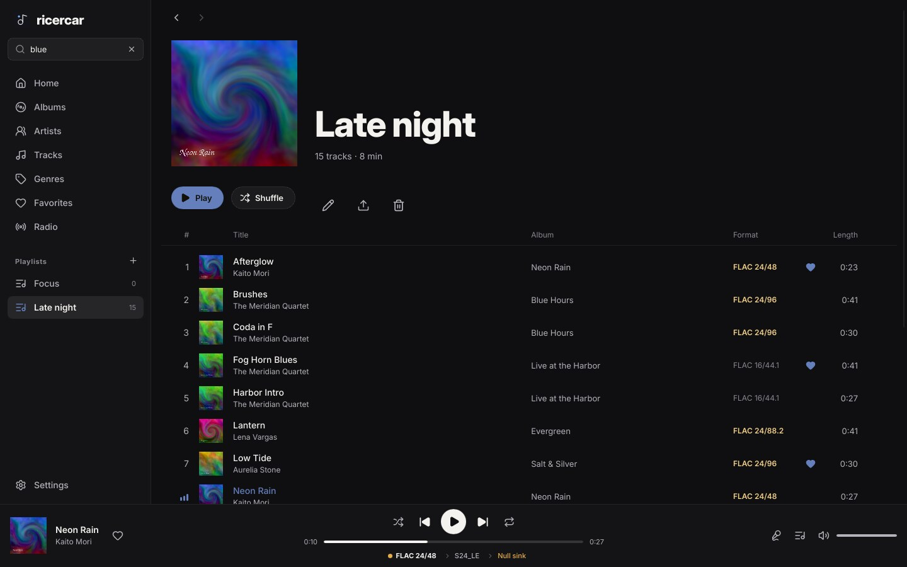</td>
</tr>
<tr>
<td align="center"><sub><b>Tracks + queue</b>: drag to reorder</sub></td>
<td align="center"><sub><b>Playlists</b>: M3U import / export</sub></td>
</tr>
<tr>
<td>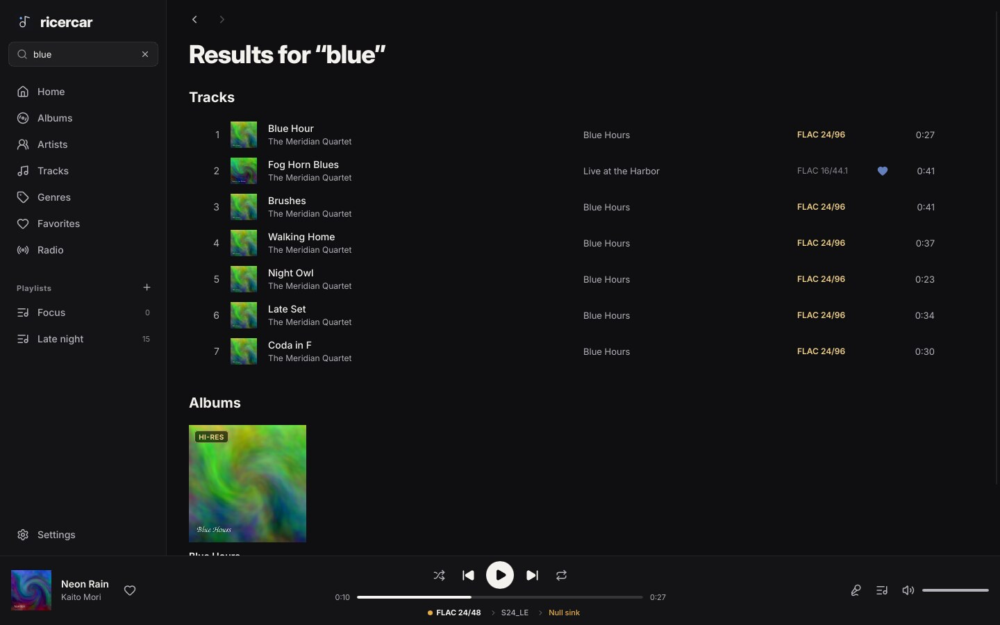</td>
<td>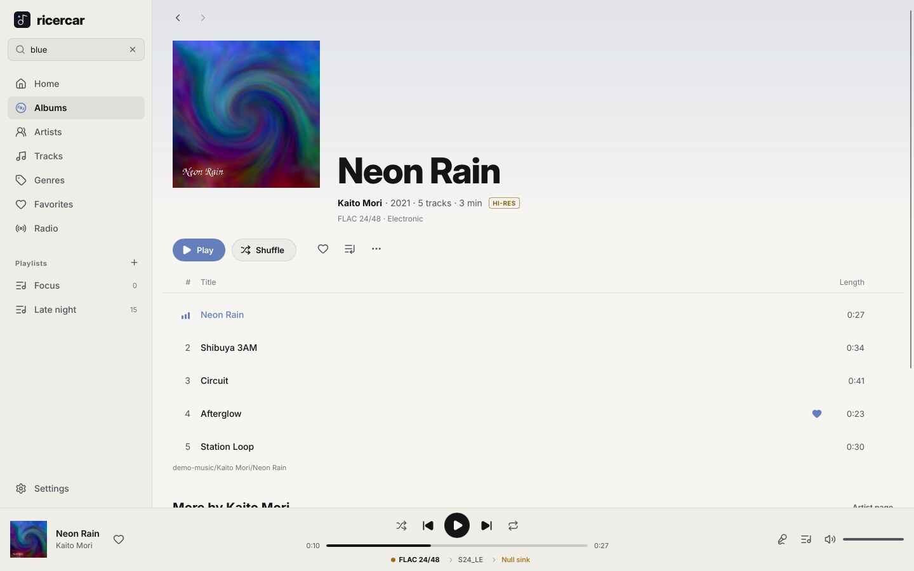</td>
</tr>
<tr>
<td align="center"><sub><b>Search</b>: artists, tracks, albums</sub></td>
<td align="center"><sub><b>Light theme</b></sub></td>
</tr>
</table>

<sub>Screenshots use a synthetic demo library (generated tones and artwork).
They are rendered with `RICERCAR_SNAPSHOT`, see [Development](#-development).</sub>

## 📦 Install

### Download a package

Every [release](https://github.com/pata27/ricercar/releases/latest) ships
ready-made packages for **x86_64** and **aarch64**:

| Your system | Package | Install |
|---|---|---|
| Debian, Ubuntu, Mint, Pop!_OS… | `.deb` | `sudo apt install ./ricercar_*.deb` |
| Fedora, openSUSE, RHEL / Alma / Rocky | `.rpm` | `sudo dnf install ./ricercar-*.rpm` |
| Arch, Manjaro, EndeavourOS, CachyOS, Omarchy | `.pkg.tar.zst` | `sudo pacman -U ricercar-*.pkg.tar.zst` |
| Anything else | `.AppImage` | `chmod +x ricercar-*.AppImage && ./ricercar-*.AppImage` |

### From source

<details open>
<summary><b>Arch / Manjaro / Omarchy</b></summary>

```sh
sudo pacman -S --needed rust alsa-lib fontconfig libxkbcommon
git clone https://github.com/pata27/ricercar && cd ricercar
cargo build --release
```

Or build the package: `cd dist/arch && makepkg -si`.
</details>

<details>
<summary><b>Debian / Ubuntu</b></summary>

```sh
sudo apt install cargo libasound2-dev libfontconfig1-dev libxkbcommon-dev pkg-config
git clone https://github.com/pata27/ricercar && cd ricercar
cargo build --release
```
</details>

<details>
<summary><b>Fedora</b></summary>

```sh
sudo dnf install cargo alsa-lib-devel fontconfig-devel libxkbcommon-devel
git clone https://github.com/pata27/ricercar && cd ricercar
cargo build --release
```
</details>

Rust 1.85 or newer is required. The binaries end up in `target/release/`:

| binary | what it is |
|---|---|
| `ricercar` | the desktop app (`--headless` for no window) |
| `ricercar-daemon` | headless player + UPnP + MPRIS, for a dedicated box |
| `ricercar-cli` | remote control over MPRIS |

Desktop integration: copy `dist/ricercar.desktop` to
`~/.local/share/applications/` and `dist/ricercar.svg` to
`~/.local/share/icons/hicolor/scalable/apps/`.

### First run

1. `./target/release/ricercar`. Your XDG music folder (usually `~/Music`)
   is indexed automatically; add others in **Settings → Library**.
2. Pick your DAC in **Settings → Audio output**. `hw:` devices are marked
   **BIT-PERFECT**; `default` / `pipewire` are marked **SHARED** (they go
   through the system mixer).
3. Press play. The green dot on the chain line under the seek bar means
   bit-perfect.

```sh
./target/release/ricercar --print-devices   # list outputs
```

## 📱 Stream from your phone

ricercar shows up on your network as a renderer, just like a hardware
streamer. Your phone app handles sign-in and browsing, and ricercar fetches
the audio itself.

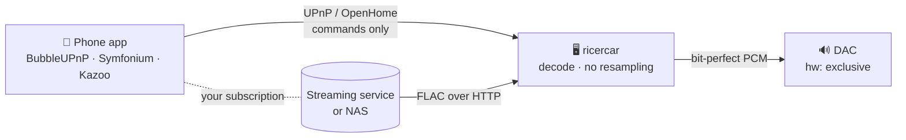

1. Start ricercar on the PC wired to your DAC (desktop app or daemon).
2. In your phone app, choose **ricercar** as the renderer. With OpenHome
   (BubbleUPnP, Kazoo…) the queue lives on the PC and your phone can sleep.
3. Play anything the app can reach. ricercar's player bar, MPRIS and the
   signal-path view show exactly what reaches the DAC.

See [docs/CONTROLS.md](docs/CONTROLS.md) for the control-point compatibility
matrix and what the protocol tests cover.

For an always-on audio box:

```sh
systemctl --user enable --now ricercar   # uses dist/ricercar.service
```

## 🎚️ Bit-perfect, for real


When the output is a `hw:` device, the volume is at 100 %, ReplayGain is off
and nothing is muted, samples reach the kernel **untouched**:

- the device is opened at the track's native rate and channel count, and a
  mismatch is refused, not resampled;
- the container holds every bit (16-bit audio may travel zero-padded in S32
  if that is all the DAC accepts, which is still bit-perfect);
- a rate change between tracks drains and reopens the device; within one
  rate, gapless is sample-exact.

The signal-path view marks each hop green (untouched) or amber (altered:
software volume, ReplayGain, a shared device…). The pipeline tests compare
decoded output **byte for byte** against ffmpeg references for every
container.

<br clear="right">

## ⌨️ Keyboard

| Keys | Action | | Keys | Action |
|---|---|---|---|---|
| <kbd>Space</kbd> | Play / pause | | <kbd>Ctrl</kbd> <kbd>F</kbd> | Search |
| <kbd>Ctrl</kbd> <kbd>→</kbd> / <kbd>←</kbd> | Next / previous | | <kbd>Ctrl</kbd> <kbd>L</kbd> | Now playing & lyrics |
| <kbd>→</kbd> / <kbd>←</kbd> | Seek ± 10 s | | <kbd>Ctrl</kbd> <kbd>Q</kbd> | Queue |
| <kbd>Ctrl</kbd> <kbd>↑</kbd> / <kbd>↓</kbd> | Volume | | <kbd>Esc</kbd> | Close panel |

## ⚙️ Configuration

Everything is editable in **Settings**. It is stored in
`~/.config/ricercar/config.toml`, and command-line flags override it for
one run.

```toml
[audio]
device = "hw:1,0"          # see --print-devices
replaygain = "off"         # off | track | album | auto
preamp_db = 0.0
restore_session = true

[library]
roots = ["/home/me/Music", "/mnt/nas/flac"]
watch = true

[network]
name = "Living room"       # name shown in phone apps
renderer = true            # UPnP AV + OpenHome renderer
media_server = true        # share the library over UPnP

[ui]
theme = "dark"             # dark | light
accent = "#d4a35a"
adaptive_colors = true     # tint the UI from the album cover
tray = true
close_to_tray = false

[scrobble]
listenbrainz_token = ""
lastfm_api_key = ""        # your own Last.fm API account

[online]
lyrics = true              # lrclib.net when no local lyrics exist
cover_art = true           # MusicBrainz / Cover Art Archive for missing covers
radio = true
```

<details>
<summary><b>Command line</b></summary>

```text
ricercar [FILE|URI]... [--headless] [--config FILE] [--device NAME] [--name NAME]
         [--db PATH] [--library DIR]... [--no-mpris] [--no-upnp] [--no-session]
ricercar --print-devices

ricercar-cli status | play | pause | toggle | stop | next | prev
ricercar-cli open FILE|URI      seek ±SECONDS      volume [0..1]
ricercar-cli shuffle [on|off]   repeat [none|track|playlist]   metadata
```

Only one instance owns the DAC: `ricercar song.flac` while ricercar is
running hands the file to the running instance.
</details>

<details>
<summary><b>Where things are stored</b></summary>

| path | content |
|---|---|
| `~/.config/ricercar/config.toml` | settings |
| `~/.local/share/ricercar/library.db` | library index, stats, playlists |
| `~/.local/share/ricercar/session.json` | queue & position |
| `~/.cache/ricercar/` | cover thumbnails, lyrics, stream spool |
</details>

## 🔒 Privacy

ricercar works fully offline. Its optional online features contact only:

| service | used for | toggle |
|---|---|---|
| lrclib.net | synced lyrics | Settings → Online extras |
| MusicBrainz / Cover Art Archive | missing album covers | Settings → Online extras |
| Radio Browser | the Radio page | opening the page |
| ListenBrainz / Last.fm | scrobbling | only with your own credentials |

No telemetry, no account, and never a streaming-service API.

## 🏗️ Architecture

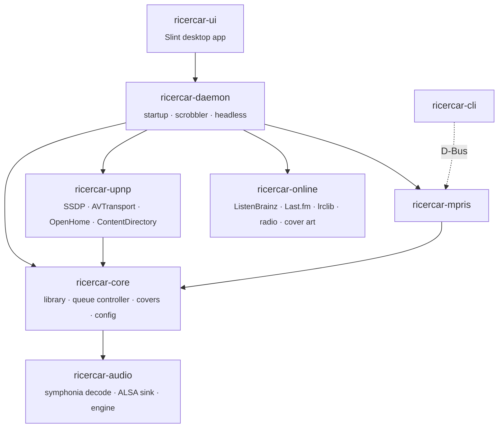

| crate | role |
|---|---|
| [`ricercar-audio`](crates/ricercar-audio) | decode + sink pipeline, engine thread, HTTP spooling |
| [`ricercar-core`](crates/ricercar-core) | SQLite/FTS5 library, tags, covers, queue controller, config |
| [`ricercar-upnp`](crates/ricercar-upnp) | SSDP / HTTP / SOAP / GENA, AVTransport, OpenHome, MediaServer |
| [`ricercar-mpris`](crates/ricercar-mpris) | `org.mpris.MediaPlayer2` on the session bus |
| [`ricercar-online`](crates/ricercar-online) | scrobbling, lyrics, radio directory, cover art |
| [`ricercar-daemon`](crates/ricercar-daemon) | shared startup, scrobbler, headless binary |
| [`ricercar-ui`](crates/ricercar-ui) | Slint desktop app (`ricercar` binary) |
| [`ricercar-cli`](crates/ricercar-cli) | MPRIS remote control |

## 🛠️ Development

```sh
cargo test --workspace                          # 180+ tests
cargo clippy --workspace --all-targets -- -D warnings
dbus-run-session -- cargo test -p ricercar-mpris
```

- **Your speakers are safe:** tests only use `null` and `file:` sinks; no
  audio is sent to hardware during `cargo test`.
- **Screenshots without a display:**
  `RICERCAR_SNAPSHOT=out/ ricercar --device null --no-upnp --no-mpris --library <dir>`
  renders the main views with Slint's software renderer and writes PNGs.
- **Translations:** French strings live in
  `crates/ricercar-ui/tools/fr.json`; run `tools/gen_po.py` after changing
  UI text (CI checks that the catalogue is up to date).
- **Design system:** tokens and rules are documented in [DESIGN.md](DESIGN.md).

## ❓ FAQ

<details>
<summary><b>Is this a Qobuz / Tidal client?</b></summary>

No. ricercar never talks to a streaming service's API. Your phone app, used
with your own subscription, sends ricercar a plain stream URL over UPnP or
OpenHome, the way it would to a network streamer. That keeps the project,
and your account, on safe ground.
</details>

<details>
<summary><b>Why is my track "altered" and not bit-perfect?</b></summary>

Open the signal-path view (click the chain line under the seek bar). Common
causes: volume below 100 %, ReplayGain enabled, mute, or a shared output
(`default`, `pipewire`, `pulse`) instead of a `hw:` device.
</details>

<details>
<summary><b>My DAC refuses a track.</b></summary>

With a `hw:` device, ricercar refuses a rate or bit depth that the DAC can't
play natively rather than resampling it. Pick the `pipewire` / `default`
output if you prefer conversion over refusal.
</details>

<details>
<summary><b>Does it work with PipeWire?</b></summary>

Yes. Selecting a `hw:` device takes the card exclusively while ricercar
plays and releases it on stop. Choose `pipewire` if you want to share the
card with other apps (not bit-perfect).
</details>

<details>
<summary><b>Can I run it on a Raspberry Pi without a screen?</b></summary>

Yes. Use `ricercar-daemon` (or `ricercar --headless`) with the systemd user
unit in `dist/`, and control it from your phone over UPnP / OpenHome.
</details>

## 🗺️ Roadmap

- [x] Bit-perfect ALSA engine, gapless, native-rate switching
- [x] UPnP AV + OpenHome renderer, UPnP MediaServer
- [x] Desktop app: library, lyrics, queue, playlists, radio, EN/FR
- [x] Scrobbling, MPRIS, tray, headless daemon
- [ ] Reports from real control points ([help wanted](docs/CONTROLS.md))
- [ ] Device capabilities panel (rates and formats your DAC accepts)
- [ ] Optional parametric EQ / convolution (clearly marked non bit-perfect)
- [ ] DSD over PCM (DoP), CUE sheets
- [ ] Composer / work views for classical music
- [ ] Flatpak and AppImage

## 🤝 Contributing

Issues and pull requests are welcome. The most useful contribution right now
is a **compatibility report**: your phone app, its version, your DAC, and
what worked or broke (see [docs/CONTROLS.md](docs/CONTROLS.md)). Please
follow [CONTRIBUTING.md](CONTRIBUTING.md), and note that the project will
not host, list or promote any code that bypasses a streaming service's
official API.

## 🙏 Acknowledgements

Built on [symphonia](https://github.com/pdeljanov/Symphonia),
[Slint](https://slint.dev), [lofty](https://github.com/Serial-ATA/lofty-rs),
[rusqlite](https://github.com/rusqlite/rusqlite) and
[zbus](https://github.com/dbus2/zbus). Typeface
[Inter](https://rsms.me/inter/) (SIL OFL), icons
[Lucide](https://lucide.dev) (ISC). Data from
[MusicBrainz](https://musicbrainz.org), [Cover Art Archive](https://coverartarchive.org),
[LRCLIB](https://lrclib.net) and [Radio Browser](https://www.radio-browser.info).
Thanks to the QBZ project for showing what a Linux hi-fi player can be.

## 📄 License

[MIT](LICENSE) © ricercar contributors. See [AUTHORS](AUTHORS).

<sub>ricercar is an independent open-source project. It is **not affiliated
with, endorsed by, or connected to** the record label *Ricercar* (Outhere),
Qobuz, or any other streaming service. "Ricercar" is used in its old musical
sense: a contrapuntal study, literally "to search".</sub>
