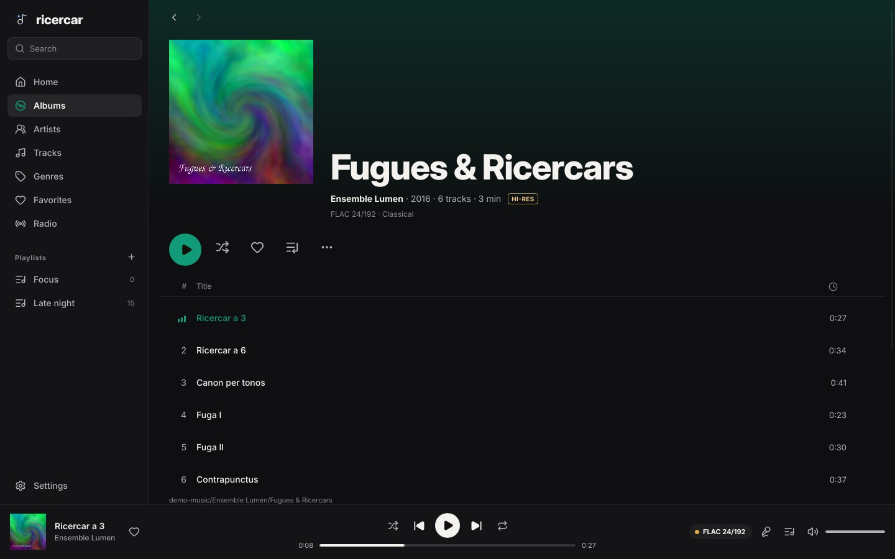

# ricercar

A native, bit-perfect music player for Linux that is also a network hi-fi
receiver. Browse and play your own lossless library in a proper desktop app,
and let apps on your phone (BubbleUPnP, Symfonium, Linn Kazoo, mConnect…)
stream to your DAC through the same clean, exclusive, no-resampling ALSA
path.



ricercar is **inspired by QBZ** but is a clean-room, from-scratch project: no
QBZ code, no shared history. Like QBZ, it deliberately contains **no private
or unofficial API client for any streaming service**. Qobuz (or any other
catalogue) reaches ricercar the way it reaches a network streamer: the app on
your phone signs in with *your* subscription and hands ricercar a plain HTTP
stream URL over UPnP/OpenHome.

## Features

**Audio**
- Bit-perfect output to `hw:` ALSA devices: exclusive, no mixer, no
  resampling, the device reopened at each track's native rate and depth.
  Lossless container negotiation (S16, S24_3LE, S24, S32) for picky USB DACs;
  a device that cannot play a format natively refuses it instead of degrading
  it.
- Gapless playback, sample-exact within a rate, pre-primed successor.
- FLAC, WAV, AIFF, ALAC, MP3, AAC and Ogg Vorbis (via symphonia).
- Signal-path view that shows every hop (source → volume → output format →
  device) and whether the chain is bit-perfect right now. Lowering the
  volume, ReplayGain or mute are shown as alterations.
- ReplayGain (track / album / auto) with preamp and peak protection, off by
  default. Proper pause (hardware pause when available), device hot-switch
  that resumes where it was, clean stop when a USB DAC is unplugged.
- HTTP streams are spooled to disk and seekable; internet radio with ICY
  titles.

**Library**
- Fast incremental indexing (only new or changed files are read, in
  parallel) with a folder watcher; SQLite + full-text search that ignores
  accents (`bjork` finds Björk) and matches prefixes.
- Albums, artists (with "appears on"), genres, all tracks, favorites, play
  counts and history, playlists with M3U/M3U8 import and export.
- Covers from embedded art, folder images (`cover.jpg`, `folder.png`, `CD1/`
  layouts…), or MusicBrainz / Cover Art Archive when missing (optional).
- Synced lyrics from `.lrc` files, embedded tags, or lrclib.net (optional).

**Desktop app**
- Home with recently played / added / most played, responsive album grid,
  album, artist, genre and playlist pages, search, radio, settings.
- Queue with drag-to-reorder, play next / add to queue / add to playlist from
  every context menu, shuffle and repeat, session restore.
- Full-screen now playing with synced, clickable lyrics over a blurred cover
  backdrop; colours follow the album cover (optional).
- Dark and light themes, accent colours, English and French, keyboard
  shortcuts, desktop notifications.

**Network & integration**
- UPnP AV MediaRenderer **and** OpenHome renderer (Product, Playlist, Info,
  Time, Volume) on the same device: the queue lives on the PC, the phone can
  sleep.
- UPnP MediaServer: browse the library from other devices (albums, artists,
  genres, playlists, search), files streamed with range requests.
- MPRIS: media keys, desktop widgets, `playerctl` and `ricercar-cli`.
- Scrobbling to ListenBrainz and Last.fm (your own token / API key), with an
  offline queue.
- Headless mode for a dedicated audio box.

See [docs/CONTROLS.md](docs/CONTROLS.md) for exactly what the UPnP/OpenHome
tests cover and the control-point compatibility matrix.

## Screenshots

| | |
|---|---|
|  |  |
|  |  |
|  |  |
|  |  |

The screenshots use a synthetic demo library (generated tones and artwork).

## Install

Build requirements: Rust 1.85+, ALSA and fontconfig headers
(`libasound2-dev libfontconfig1-dev` on Debian/Ubuntu, `alsa-lib fontconfig`
on Arch).

```sh
cargo build --release
./target/release/ricercar            # desktop app
./target/release/ricercar --headless # renderer + MPRIS only, no window
```

`dist/ricercar.desktop` and `dist/ricercar.svg` integrate the app with your
desktop (copy them to `~/.local/share/applications` and
`~/.local/share/icons/hicolor/scalable/apps`). Arch users can build
`dist/arch/PKGBUILD` with `makepkg -si`.

For a dedicated audio box, `dist/ricercar.service` runs `ricercar-daemon`
as a systemd user service (`systemctl --user enable --now ricercar`).
Only one instance owns the DAC: launching `ricercar FILE` while it runs
hands the file to the running instance.

On first start ricercar indexes `~/Music` (or your XDG music folder); add more
folders in **Settings → Library**. Pick the output in **Settings → Audio
output**: `hw:` devices are bit-perfect, `default`/`pipewire` go through the
system mixer.

### Streaming from your phone

1. Start ricercar (desktop or `--headless`) on the PC connected to your DAC.
2. In BubbleUPnP (or Kazoo, Symfonium, mConnect…) pick **ricercar** as the
   renderer (OpenHome or UPnP AV).
3. Play from any source the app supports with your own subscription. The
   stream goes straight from the service to ricercar; the phone only sends
   commands.

## Command line

```
ricercar [--headless] [--config FILE] [--device NAME] [--name NAME]
         [--db PATH] [--library DIR]... [--no-mpris] [--no-upnp] [--no-session]
ricercar --print-devices

ricercar-cli status | play | pause | toggle | stop | next | prev
ricercar-cli open FILE|URI      seek ±SECONDS      volume [0..1]
ricercar-cli shuffle [on|off]   repeat [none|track|playlist]   metadata
```

Settings live in `~/.config/ricercar/config.toml` (the app writes it; flags
override it for one run). The library database and session are in
`~/.local/share/ricercar`, caches (covers, lyrics, stream spool) in
`~/.cache/ricercar`.

### Keyboard

| Key | Action |
|---|---|
| Space | Play / pause |
| Ctrl + → / ← | Next / previous track |
| → / ← | Seek 10 s |
| Ctrl + ↑ / ↓ | Volume |
| Ctrl + F | Search |
| Ctrl + L | Now playing / lyrics |
| Ctrl + Q | Queue |
| Esc | Close panel |

## Bit-perfect policy

When the output is a `hw:` device, the volume is 100 %, ReplayGain is off and
nothing is muted, samples go to the kernel untouched in a container that
holds every bit (16-bit content can travel zero-padded in S32 if that is all
the DAC accepts — still bit-perfect). A rate change between tracks drains and
reopens the device; gapless within the same rate is sample-exact. The
exact-pipeline tests in `crates/ricercar-audio/tests` compare decoded output
byte-for-byte against ffmpeg references for every container.

## Online services and privacy

ricercar works fully offline. Optional features contact:
- **lrclib.net** for lyrics and **MusicBrainz / Cover Art Archive** for
  missing covers (toggle in Settings → Online extras);
- **Radio Browser** when you open the Radio page;
- **ListenBrainz / Last.fm** only when you configure your own credentials.

No telemetry. No streaming-service API is ever called.

## Layout

| crate | role |
|---|---|
| `ricercar-audio` | decode + sink pipeline, engine thread, HTTP spooling |
| `ricercar-core` | library DB, tags, covers, queue controller, config |
| `ricercar-upnp` | SSDP / HTTP / SOAP / GENA, AVTransport, OpenHome, ContentDirectory |
| `ricercar-mpris` | org.mpris.MediaPlayer2 on the session bus |
| `ricercar-online` | ListenBrainz, Last.fm, lrclib, Radio Browser, Cover Art Archive |
| `ricercar-daemon` | shared startup, scrobbler, headless binary |
| `ricercar-ui` | Slint desktop app (`ricercar` binary) |
| `ricercar-cli` | MPRIS remote control |

## Development

```sh
cargo test --workspace
cargo clippy --workspace --all-targets -- -D warnings
```

Tests only use `null` and `file:` sinks — no audio is ever sent to your
hardware during `cargo test`.

`RICERCAR_SNAPSHOT=<dir> ricercar --device null --library <demo>` renders the
main views headlessly with Slint's software renderer and writes PNGs (that is
how the screenshots above are made). French strings live in
`crates/ricercar-ui/tools/fr.json`; run `tools/gen_po.py` after changing UI
text.

## License

MIT. See `LICENSE` and `AUTHORS`. Inter is under the SIL Open Font License,
Lucide icons under the ISC license (see `crates/ricercar-ui/assets`).

ricercar is an independent open-source project. It is **not affiliated with,
endorsed by, or connected to** the Belgian record label *Ricercar*
(Outhere), nor to Qobuz or any other streaming service. "Ricercar" here is
used in its old musical sense (a contrapuntal study, literally "searching").
Streaming playback depends on your own subscription and a third-party
control point.
